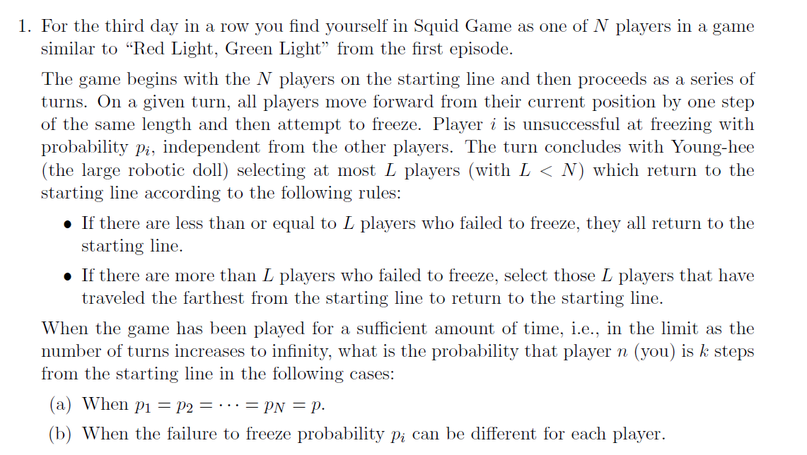

# Numerical-Analysis-Problem-Equilibrium-Probability-Distributions-in-Squid-Game-Dynamics
Players progress in turns, moving forward and attempting to freeze with a certain probability of failure. The game's complexity arises from the rule where players who fail to freeze may be sent back to the starting line based on specific conditions.

## Solution Description
For the first question, I found a strict recursive solution through mathematical methods and then verified it through computer simulation. Additionally, I included two alternative methods (approximate solutions) that I thought of during the process in the documentation I submitted to the professor. For the second question, I derived inspiration from the approximate solution of the previous question. Although it involves an infinite interval probability distribution, I identified a potential approximate function. I collected simulated data and designed a neural network to predict this approximate function. Fortunately, the neural network converged successfully.

## Motivation
This was an extra problem (an open-ended question) posed by my professor in my Numerical Analysis class. It was stated that anyone who solved it could receive an extra 10 points on their final score (out of a total of 100 points). I spent about a month intermittently solving the two parts of the problem, a task the professor estimated would generally take 4-6 months.

## Additional Notes
I have organized my thoughts in a PDF document, although it is written in Chinese.

